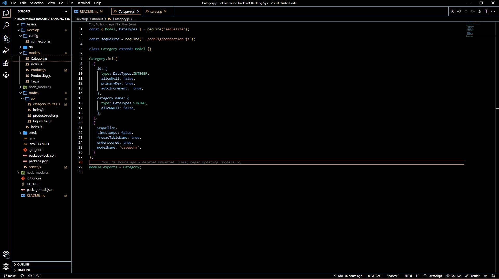
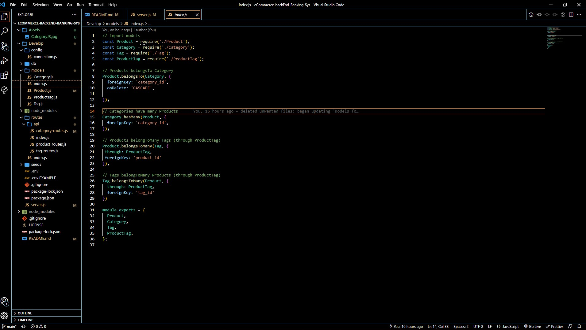
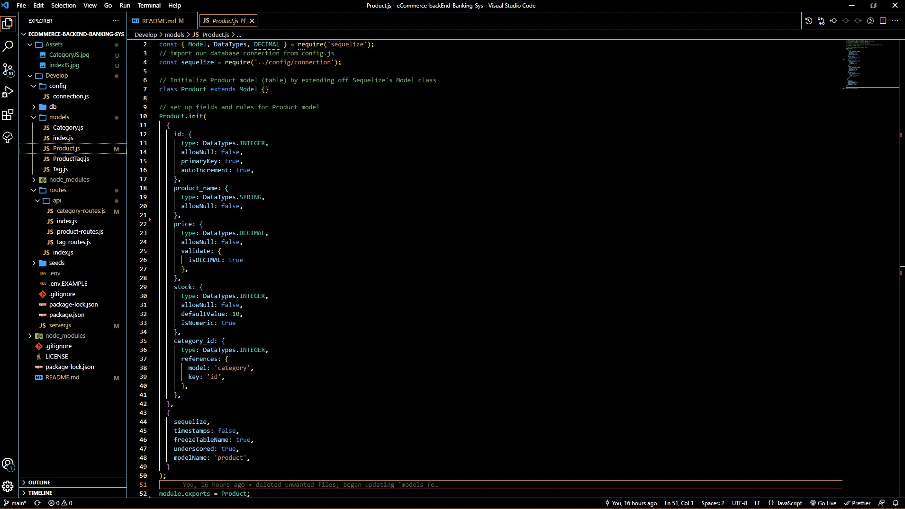
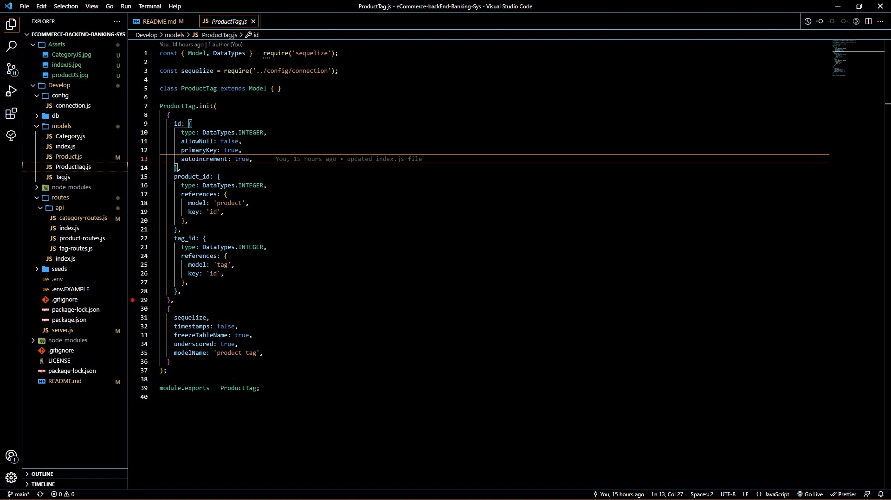
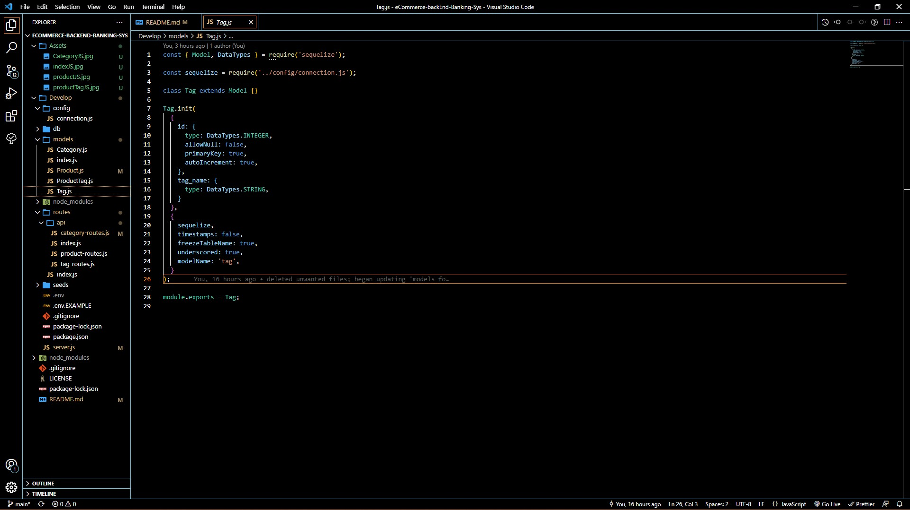

# Project_Title
ECOMMERCE-BACKEND-BANKING-SYS

## Description:
ECOMMERCE-BACKEND-BANKING-SYSTEM  is an online ecommerce business that stores information such as inventory, cost, product names and stores them all inside of a dynamically interactive database. It also has built in security functions to safely handle your sensitive information. 

#### Table of Contents

*[Project_Title](#project_title)
*[Desciption](#description)
*[Contributors](#contributors)
*[Media](#media)
*[Packages](#packages)
#### Contributors
Alfonso Robles

#### Packages
*[Npm mysql2]
*[Npm Sequelize]
*[Npm dotenv]
#### Media
[ECOMMERCE-BANKING-SYS]()

