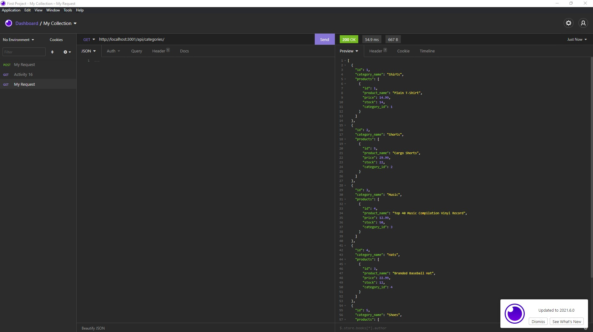
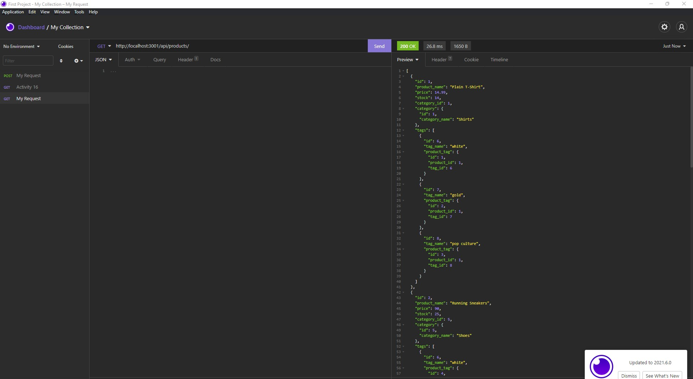
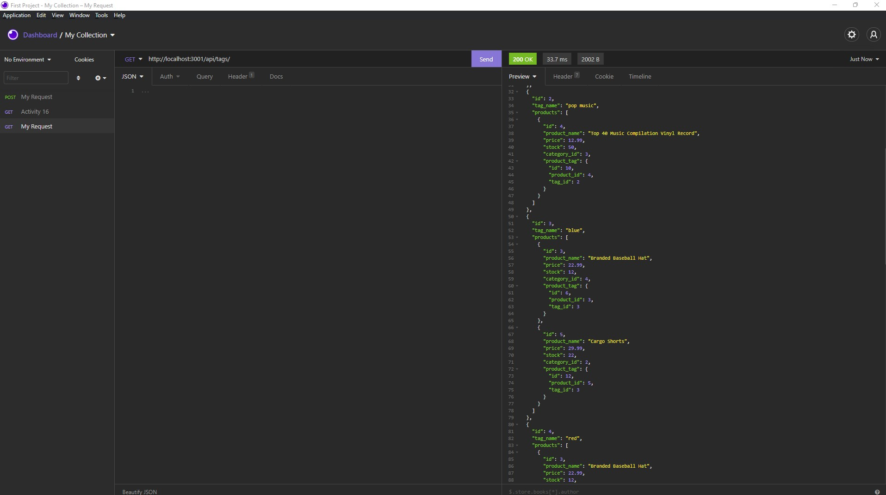

# Project_Title

ECOMMERCE-BACKEND-BANKING-SYS

## Description:

ECOMMERCE-BACKEND-BANKING-SYSTEM is an online ecommerce business application that stores information such as inventory, cost, product names and stores them inside of an interactive database. It also has built in security functions to safely handle sensitive information.

### Table of Contents

_[Project_Title](#project_title)
_[Desciption](#description)
_[Contributors](#contributors)
_[Packages](#packages)
\_[Media](#media)

### Contributors

Alfonso Robles

#### Packages

-[Npm mysql2] -[Npm Sequelize] -[Npm dotenv]

#### Media

[ECOMMERCE-BANKING-SYS media link](https://watch.screencastify.com/v/eHq8xBUBps21mRlkNxPB)

[ECOMMERCE-BANKING-SYS media link](https://watch.screencastify.com/v/ynxwQGhC0s52caGOGaAK)

